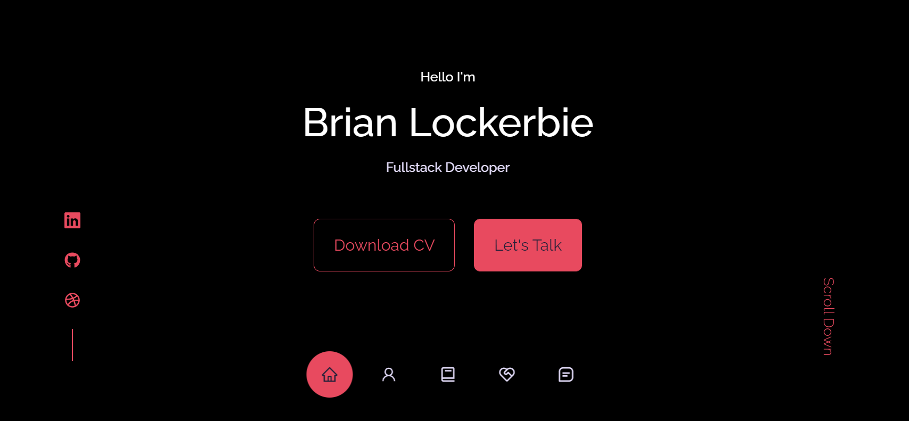
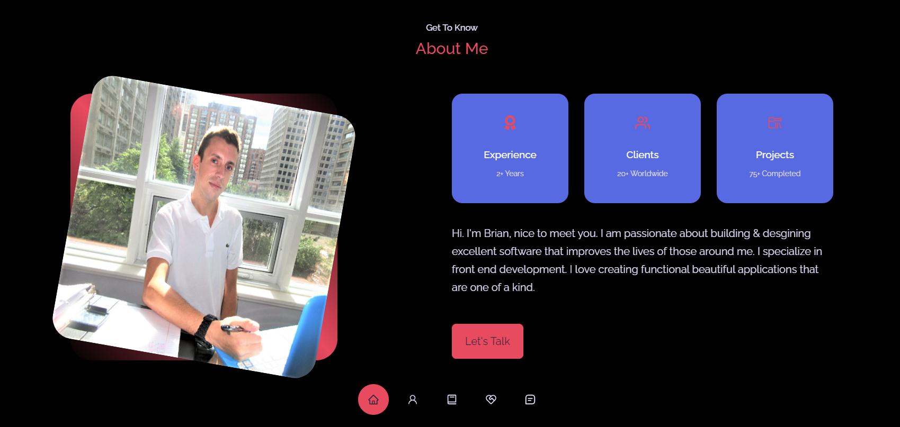
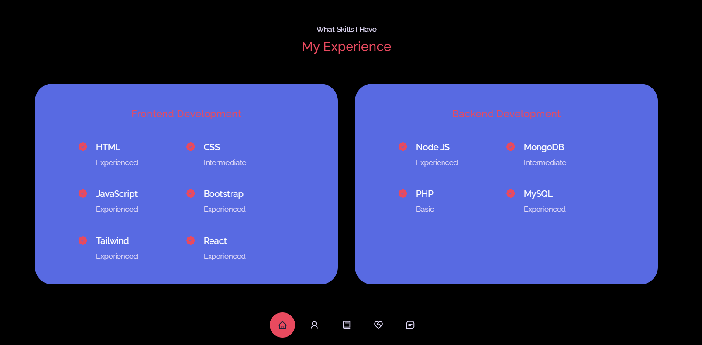
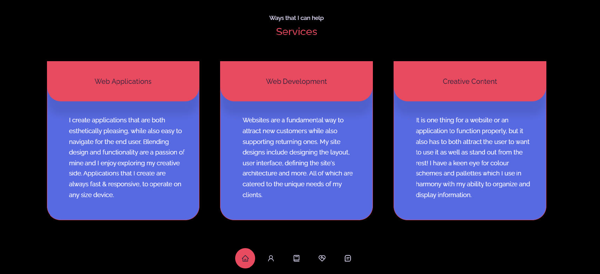
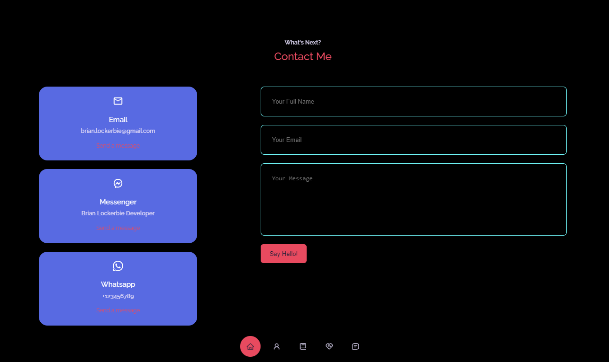

<h1 align="center">Brian Lockerbie | Portfolio </h1>

## Description
This is a portfolio of some of my work I created using the React library.

## Technologies
* HTML
* CSS
* JavaScript
* React

## Table of Contents

- [Installation](#installation)
- [Usage](#usage)
- [Screenshot](#screenshot)
- [License](#license)

## User Story
AS AN employer looking for candidates with experience building single-page applications 
I WANT to view a potential employee's deployed React portfolio of work samples 
SO THAT I can assess whether they're a good candidate for an open position

## Acceptance Criteria
GIVEN a single-page application portfolio for a web developer 
WHEN I load the portfolio 
THEN I am presented with a page containing a header, a section for content, and a footer 
WHEN I view the header 
THEN I am presented with the developer's name and navigation with titles corresponding to different sections of the portfolio 
WHEN I view the navigation titles 
THEN I am presented with the titles About Me, Portfolio, Contact, and Resume, and the title corresponding to the current section is highlighted 
WHEN I click on a navigation title 
THEN I am presented with the corresponding section below the navigation without the page reloading and that title is highlighted 
WHEN I load the portfolio the first time 
THEN the Aboutvtitle and section are selected by default 
WHEN I am presented with the About section 
THEN I see a recent photo or avatar of the developer and a short bio about them 
WHEN I am presented with the Portfolio section 
THEN I see titled images of six of the developer’s applications with links to both the deployed applications and the corresponding GitHub repository 
WHEN I am presented with the Contact section 
THEN I see a contact form with fields for a name, an email address, and a message 
WHEN I move my cursor out of one of the form fields without entering text 
THEN I receive a notification that this field is required 
WHEN I enter text into the email address field 
THEN I receive a notification if I have entered an invalid email address 
WHEN I am presented with the Resume section 
THEN I see a link to a downloadable resume and a list of the developer’s proficiencies 
WHEN I view the footer 
THEN I am presented with text or icon links to the developer’s GitHub and LinkedIn profiles, and their profile on a third platform (Stack Overflow, Twitter) 

## Installation
First clone the repository from GitHub. Run npm install. Edit/change the values in work & social media links. Run npm start to start the application live on your local server port. (http://localhost:3000).

## Usage
Live link [here](https://brian-lockerbie.com)

## Screenshot

## License
 
This project is licensed under the MIT License - see the [license info](https://opensource.org/licenses/MIT) for more details.